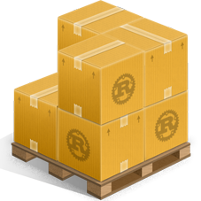

## Key Derivation Functions: Argon2, scrypt

> 🔐 **Used in:** password storage, login systems, encrypted vaults, disk encryption, backup tools
>
> ✅ Essential anytime a password becomes a key.

A password is not a cryptographic key.
It’s short, predictable, and attacker-friendly.

So when you see requirements like:

- “derive an encryption key from a passphrase”
- “store user passwords safely”
- “turn a shared secret into multiple keys”

You need a Key Derivation Function (KDF)[^kdf].

This chapter focuses on the most important real-world case: password-based key derivation using Argon2id[^argon2] and scrypt[^scrypt].

## The Problem: Passwords Are Weak Secrets

If an attacker steals your password database (or an encrypted vault file), they don’t need to “hack your login”.

They can do offline guessing: try billions of password candidates on their own hardware until one works.

Your goal is simple: make each password guess expensive.

That’s what password KDFs do:
- they turn one password guess into lots of CPU work
- and (for Argon2/scrypt) lots of memory

## Salt: The Non-Secret Value That Stops Mass Attacks

Every password hash / derived key must use a unique, random salt[^salt].

Salt is:
- public (stored next to the hash / ciphertext)
- unique per user / per encrypted file
- what prevents “same password ⇒ same output” across victims

Without salts, attackers can reuse work at scale.

## What You Should Store (And What You Must Not)

For password storage, you store:

- the algorithm + parameters (e.g. Argon2id time/memory settings)
- the salt
- the resulting password hash

You must **never** store:
- the plaintext password
- a fast hash of the password (like SHA-256(password))

Modern libraries typically serialize all of this into a single string (e.g. a PHC-style[^phc] hash string).

## Argon2id: the modern default

> 💡 Used in password managers, servers, vaults, modern security guidance.
> Memory-hard, tunable, and the recommended Argon2 variant today

>  Crate used: [argon2](https://crates.io/crates/argon2)

Argon2id is designed to make password cracking expensive on GPUs/ASICs[^gpu-asics] by forcing large memory usage per guess.

What you tune (conceptually):
- memory (MiB)
- time (iterations)
- parallelism (lanes/threads)

Rule of thumb: tune it so verification is “noticeable but acceptable” on your server, then periodically raise cost over time.

🧪 **Code Example: Argon2id** ([source code](https://github.com/VinEckSie/sealed-in-rust/blob/main/rust_crypto_book_code/src/lib.rs#L82))

```rust,no_run
{{#include ../../rust_crypto_book_code/src/lib.rs:argon2id}}
```

Output:
```text
Argon2id hash: $argon2id$v=19$m=19456,t=2,p=1$2SgpVk7SNjbMVDerM8ObNw$fJLxxiOuQK02MAx/bBYCydPDRQtMpi+gcqeWIJHUgaQ
```

> 🚨 **Critical rule**
> : Do not invent your own parameters or string formats.
> Use the library’s encoded hash format and verify with the library.

> **🟢 Conclusion**
>
> If you’re building a new system that stores passwords, Argon2id is the default choice.

## Scrypt: still strong, still common

> 💡 Used in older-but-still-secure systems, disk encryption formats, cryptocurrencies. Memory-hard, widely deployed

>  Crate used: [scrypt](https://crates.io/crates/scrypt)

Scrypt has the same high-level goal as Argon2: make brute-force expensive, especially on specialized hardware.
It’s still a valid choice, especially when interoperability matters.

🧪 **Code Example: scrypt** ([source code](https://github.com/VinEckSie/sealed-in-rust/blob/main/rust_crypto_book_code/src/lib.rs#L104))

```rust,no_run
{{#include ../../rust_crypto_book_code/src/lib.rs:scrypt}}
```

Output:
```text
scrypt-derived key: 1b1829d47138ed3fddf496d90bd8f4da1a06b9ad18b4be890aa2d10cd7079326
```

> 🚨 **Critical rule**
> : Store the salt and parameters alongside the ciphertext so you can derive the same key during decryption.

> **🟢 Conclusion**
>
> If you can’t use Argon2id for some reason, scrypt is the next best widely-supported option.

## KDFs in Real Systems: Password → Encryption Key

If you derive a key from a password, it usually feeds into an AEAD (like AES-GCM or ChaCha20-Poly1305).

The secure pattern looks like this:

```text
password + salt + KDF parameters → 32-byte key → AEAD encrypt/decrypt
```

What must be persisted:
- salt + KDF parameters (public)
- AEAD nonce (public, unique)
- ciphertext + tag

If you lose the salt/params/nonce, you lose decryptability.

## Argon2 vs scrypt vs PBKDF2

| If you need…                          | Use                      |
| ------------------------------------- | ------------------------ |
| Best default for new password storage | Argon2id                 |
| Broad legacy interoperability         | scrypt                   |
| “Legacy-safe” baseline only           | PBKDF2[^pbkdf2]          |

> 🚨 **Critical rule**
> : Password KDFs (Argon2/scrypt/PBKDF2) are for weak secrets.
> For deriving multiple keys from an already-strong secret, use HKDF[^hkdf] instead.

> **🟢 Conclusion**
>
> Passwords are attacker-controlled inputs.
>
> A proper KDF turns each password guess into a costly operation, making offline attacks dramatically harder.
>
> Practical rule: use Argon2id by default, fall back to scrypt when needed, and treat parameter + salt storage as part of your cryptographic design.


[^kdf]: KDF: Key Derivation Function. Derives cryptographic keys from a secret (often with salt/context), producing the right-length key material and supporting key separation. [More](../99-appendices/99-01-glossary.md#kdf)
[^argon2]: Argon2: Modern memory-hard password hashing and KDF (recommended variant: Argon2id). [More](../99-appendices/99-01-glossary.md#argon2)
[^scrypt]: scrypt: Memory-hard password-based KDF. [More](../99-appendices/99-01-glossary.md#scrypt)
[^salt]: Salt: Non-secret random value used to ensure uniqueness and defeat precomputation. [More](../99-appendices/99-01-glossary.md#salt)
[^pbkdf2]: PBKDF2: Iterated HMAC-based password KDF (not memory-hard). [More](../99-appendices/99-01-glossary.md#pbkdf2)
[^hkdf]: HKDF: Key expansion KDF for strong secrets (not passwords). [More](../99-appendices/99-01-glossary.md#hkdf)
[^phc]: PHC: Standard string format that encodes a password hash/KDF output plus its parameters and salt. [More](../99-appendices/99-01-glossary.md#phc)
[^gpu-asics]: GPU/ASIC attacks: Password cracking on specialized hardware; memory-hard KDFs aim to make each guess expensive. [More](../99-appendices/99-01-glossary.md#gpu-asics)
